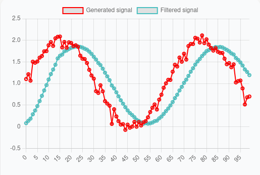
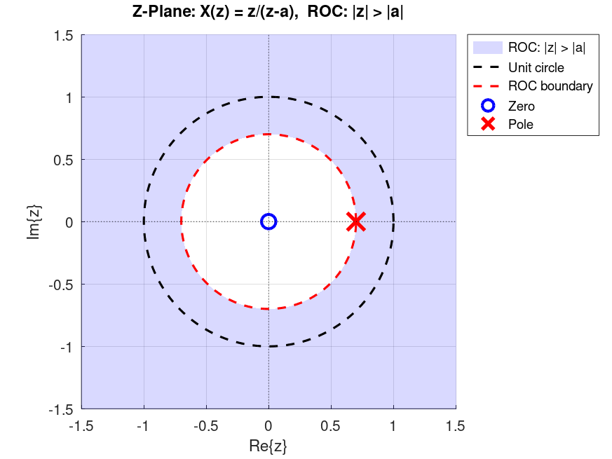

# Digital Filter overview
In this section, we'll discuss the meaning of *filtering* and *frequency-selective digital filters* in the context of digital signal processing (DSP).
Let's say we have a discrete-time signal denoted by \\(x[n]\\), where \\(n\\) is an integer that denotes the sample number of the signal.
We can plug the input signal \\(x[n]\\) into the following equation, called a **linear constant-coefficient difference equation** (abbreviated as **LCCDE**):
\\[
y[n] = \sum_{k=0}^{M} b_k x[n-k] - \sum_{k=1}^{N} a_k y[n-k].
\\]
In this equation, we consider the left-hand side, \\(y[n]\\), the output of the system, and the terms \\(x[n-k]\\) and \\(y[n-k]\\) are past samples of the input and output respectively.
The values \\(a_k\\) and \\(b_k\\) are some coefficients.
The output \\(y[n]\\) obtained by applying the equation passes certain frequencies of the input and filters out others. Here, the "frequencies" in the input signal come from the theory of Fourier analysis.
The theory of Fourier analysis, which was originally developed for continuous-time signals, gives us a set of formulas to decompose almost any signal (under mild assumptions) into a sum of sinusoidal terms.
An LCCDE acts as a system that passes (or boosts) certain frequency bands and blocks (or attenuates) others.
As a concrete example, if the coefficients of an LCCDE are chosen so that the equation acts as a **low-pass filter**, the system allows slowly varying components of the input signal to pass while attenuating rapidly varying components.

The figure below shows an example input signal and its corresponding output after applying a low-pass filter.

<figure style="text-align: center;">
  
  <figcaption>Figure 1: A signal and the output of a lowpass filter on the same signal</figcaption>
</figure>

As we can see in the figure, the output of the filter retains the slowly-varying sinusoidal component of the input and has the high-frequency sinusoidal components (essentially the noise in the input signal) removed.

Above, we saw a general overview of how LCCDE acts a frequency selective filter without going through the detail of the math behind it.
In what follows, we look at some of the rigorous mathematics behind what discussed above.

We'll first look at discrete Fourier series, which is a tool to decompose a *periodic* discrete-time signal in terms of sinusoids.
Next, we'll see how the same idea can be expanded to represent *aperiodic* signals in terms of sinusoids via discrete-time Fourier Transform (DTFT).
Lastly, we see yet another type of transform called the *Z-transform*.
As we'll see, Z-Transform is the tool that is used to solve LCCDEs, and moreover, it is a generalization of DTFT.
Consequently, the application of Z-transform is two folds.
It both allows us to solve LCCDEs, as well as calculating their effect on different frequency component of an input signal. 

## Complex numbers and Euler's formula

Before continuing, we shall have a basic understanding of complex numbers and Euler's formula.

A complex number is a number that has the general form
\\[
a + bi
\\]
where \\(a\\) and \\(b\\) are arbitrary real-valued numbers and \\(i=\sqrt{-1}\\).

An important property of complex numbers is that they form a *field*. This means that they obey all the familiar rules such as associativity, commutativity, distributivity, and so on, which real numbers also obey.
For instance, the following expression is valid for complex numbers:
\\[
z_1(z_2 + z_3) = z_1z_2 + z_1z_3
\\]
where \\(z_1\\), \\(z_2\\), and \\(z_3\\) are complex-valued numbers. This is an application of the distributive law.

When dealing with complex numbers, a term that we will use frequently is something called the ***complex conjugate***.
A complex number is a complex conjugate of another complex number if their real parts are the same and their imaginary parts have opposite signs.
For instance, numbers \\(z_1 = 2 + 3j\\) and \\(z_2 = 2 - 3j\\) are the complex conjugates of each other.
Moreover, to show a number is complex conjugate of another number we often use the the star symbol.
For example, we write \\(z_1 = z_2^{\star}\\).

What we've seen so far are complex numbers. We also have *complex exponentials*. These are expressions of the form \\(e^{j\theta}\\), where \\(e\\) is Euler's constant, \\(j=\sqrt{-1}\\), and \\(\theta\\) is any real-valued number.

Complex exponentials are related to trigonometric functions via *Euler's formula*. This formula is stated below:
\\[
e^{j\theta} = \cos(\theta) + j\sin(\theta)
\\]
Where does this formula come from?

In one view, Euler's formula can simply be taken as a *definition* of what it means to raise \\(e\\) to the power \\(j\theta\\). In another approach, we first define what it means to raise \\(e\\) to a general complex number \\(z\\):
\\[
e^{z} = \sum_{n=0}^{\infty} \frac{z^n}{n!} = 1 + z + \frac{z^2}{2!} + \frac{z^3}{3!} + \cdots
\\]
Substituting \\(z=j\theta\\) yields Euler's formula. Either way, we arrive at the same result.

But the question that still remains is: how does this relationship (whether defined or derived) help us?

The answer is that almost all of the familiar rules for *real exponentials* also hold for complex exponentials. For instance,
\\[
e^{j(a+b)} = e^{ja}e^{jb}.
\\]

To prove this, we can rewrite the left-hand side using Euler's formula, apply trigonometric identities, and then use Euler's formula again to obtain the right-hand side.

Differentiation also carries over from real exponentials to complex exponentials. Specifically,
\\[
\frac{d}{dx}e^{jx}=je^{jx}.
\\]

Proof:

\\[
\frac{d}{dx}e^{jx} = \frac{d}{dx}(\cos x+j\sin x) = -\sin x+j\cos x = je^{jx}.
\\]

Euler's formula is used extensively in signal processing because it often gives us a shortcut when computing different transforms. More importantly, it allows us to relate certain transforms to other ones, such as the DTFT to the Z-transform (as we'll see later), or the CTFT to the Laplace transform.

## Discrete Fourier Series

Consider a *periodic* discrete-time signal \\(x[n]\\) with period \\(N_0\\). That means

\\[
x[n+N_0]=x[n].
\\]

Where \\(N_0\\) is an integer. 
We can rewrite such signals as sums of complex exponentials:
\\[
x[n]=\sum_{k=0}^{N_0-1}a_ke^{jk\omega_0n}, \qquad \omega_0=\frac{2\pi}{N_0}.
\\]

This is called the **Discrete Fourier Series (DFS)** expansion of the signal \\(x[n]\\).

Expanding the sum gives us \\(N_0\\) equations with \\(N_0\\) unknowns. In matrix notation, we have \\(Ax=b\\), where \\(A\\) is a matrix consisting of complex exponential terms, \\(x\\) is a vector containing the unknown coefficients that we are trying to find, and \\(b\\) contains the values of the signal at different samples.
In other words, DFS is merely a system of \\(N\\) equation and \\(N\\) unknowns.

Can we apply standard Gaussian elimination to solve such systems?

The answer is yes.
Complex numbers form a field, and Gaussian elimination works on any matrix whose entries belong to a field.
Hence, it can be used to solve \\(Ax=b\\).

Even though Gaussian elimination gives us a method for computing the DFS coefficients, in practice we exploit a special property of the matrix \\(A\\) and compute the coefficients using the closed-form formula:
\\[
a_k=\frac{1}{N_0}\sum_{n=0}^{N_0-1}x[n]e^{-jk\omega_0n}, \qquad \omega_0=\frac{2\pi}{N_0}.
\\]

As an example, suppose we want to compute the DFS coefficients of the periodic signal \\(x[0]=2\\), \\(x[1]=1\\), \\(x[2]=3\\), and \\(x[3]=3\\) (with \\(x[n]=x[n \bmod 4]\\)).

\\[
k=0 \rightarrow e^{j2\pi(n)(0)/4} = 1,1,1,1 \rightarrow a_0=\frac{1}{4}(2+1+3+3)=\frac{9}{4}
\\]

\\[
k=1 \rightarrow e^{j2\pi(n)(1)/4} = 1,-j,-1,j \rightarrow a_1=\frac{1}{4}(2-j-3+3j) = -\frac{1}{4}+j\frac{1}{2}
\\]

\\[
k=2 \rightarrow e^{j2\pi(n)(2)/4} = 1,-1,1,-1 \rightarrow a_2=\frac{1}{4}(2-1+3-3) = \frac{1}{4}
\\]

\\[
k=3 \rightarrow e^{j2\pi(n)(3)/4} = 1,j,-1,-j \rightarrow a_3=\frac{1}{4}(2+j-3-3j) = -\frac{1}{4}-j\frac{1}{2}
\\]

An interesting observation is that, after expanding the signal in terms of complex exponentials, we obtain

\\[
x[n] = \frac{9}{4}e^{j2\pi(0)n/4} + \left(-\frac{1}{4}+j\frac{1}{2}\right)e^{j2\pi n/4} + \frac{1}{4}e^{j4\pi n/4} + \left(-\frac{1}{4}-j\frac{1}{2}\right)e^{j6\pi n/4}
\\]

\\[
= \frac{9}{4}e^{j2\pi(0)n/4} + \left(-\frac{1}{4}+j\frac{1}{2}\right)e^{j2\pi n/4} + \left(-\frac{1}{4}-j\frac{1}{2}\right)e^{-j2\pi n/4} + \frac{1}{4}e^{j\pi n}
\\]

\\[
= \frac{9}{4} - \frac{1}{2}\cos\left(\frac{\pi n}{2}\right) - \sin\left(\frac{\pi n}{2}\right) + \frac{1}{4}\cos(\pi n)
\\]

By rearranging the terms, we expressed the signal as a sum of harmonically related *real-valued* sines and cosines.

In general, for any *real-valued* signal, the DFS coefficients satisfy
\\[
a_{N-k}=a_k^{\ast},
\\]
where \\(N\\) is the period and \\(^{\ast}\\) denotes complex conjugation.

As a consequence, we can pair the \\(k\\) and \\(N-k\\) terms together to obtain real-valued sinusoids.

## Discrete-Time Fourier Transform

We saw how the DFS can decompose a periodic discrete-time signal.
If a signal is **aperiodic**, a related but different transform called the **Discrete-Time Fourier Transform (DTFT)** can be used.

Below we see how the DTFT can be derived from the DFS. The basic idea is to construct a periodic signal by appending zeros to an aperiodic signal and then repeating that signal to make it periodic.
We then apply DFS on this periodic signal.
In this setup, as the number of appended zeros approaches infinity, the DFS becomes the DTFT.

Let \\(x[n]\\) be an aperiodic signal that is nonzero only for
\\[
N_1 \le n \le N_2.
\\]

Choose a period \\(N \ge N_2-N_1+1\\) and construct the periodic extension of \\(x[n]\\) by repeating one period that contains the entire nonzero portion of the signal. The DFS coefficients are

\\[
a_k = \frac{1}{N}\sum_{n=0}^{N-1}x[n]e^{-jk\omega_0n} = \frac{1}{N}\sum_{n=-\infty}^{\infty}x[n]e^{-jk\omega_0n} = \frac{1}{N}X(e^{j\omega_0k}),
\\]

where
\\[
\omega_0=\frac{2\pi}{N},
\\]
and \\(X(e^{j\omega})\\) is a function of \\(\omega\\) that we would call the 'DTFT'.

The synthesis equation then becomes

\\[
x[n] = \sum_{k=0}^{N-1}a_ke^{jk\omega_0n} = \frac{1}{N}\sum_{k=0}^{N-1}X(e^{j\omega_0k})e^{jk\omega_0n}.
\\]

Using the relation
\\[
\omega_0=\frac{2\pi}{N},
\\]
we obtain

\\[
x[n] = \frac{1}{2\pi} \sum_{k=0}^{N-1} X(e^{j\omega_0k}) e^{jk\omega_0n} \,\omega_0.
\\]

As \\(N\rightarrow\infty\\), we have \\(\omega_0\rightarrow0\\), and the sum becomes an integral:

\\[
x[n] = \frac{1}{2\pi} \int_0^{2\pi} X(e^{j\omega}) e^{j\omega n} d\omega.
\\]

In summary, an aperiodic discrete-time signal can be expressed as an integral of complex exponentials through the Discrete-Time Fourier Transform (DTFT):

**Synthesis**
\\[
x[n] = \frac{1}{2\pi} \int_0^{2\pi} X(e^{j\omega}) e^{j\omega n} d\omega.
\\]

**Analysis**
\\[
X(e^{j\omega}) = \sum_{n=-\infty}^{\infty} x[n] e^{-j\omega n}.
\\]

The **analysis** equation computes the DTFT \\(X(e^{j\omega})\\) from the signal \\(x[n]\\), while the **synthesis** equation reconstructs \\(x[n]\\) from its DTFT.

## Some notes about DTFT
The conjugate property for *real-valued* signals that we saw for the DFS also holds for the DTFT. That is,
\\[
X(e^{j\omega}) = X^*(e^{-j\omega}).
\\]

For discrete-time complex exponentials (as well as discrete-time sinusoids), adding \\(2\pi\\) to the frequency gives the same function, i.e.,
\\[
e^{j(\omega+2\pi)n}=e^{j\omega n}.
\\]
As a result, the DTFT \\(X(e^{j\omega})\\) is always periodic with period \\(2\pi\\).
Hence, to plot the result of DTFT, it is enough plot only \\(2\pi\\) interval of the graph.

The DTFT analysis equation \\(X(e^{j\omega})\\), in practice, is often computed analytically using identities such as the *geometric series*:
\\[
1+a+a^2+\cdots=\frac{1}{1-a}, \qquad |a|<1.
\\]

(The geometric series is valid for both real-valued as well as complex-valued numbers).

## An example of DTFT

Find the DTFT of the signal
\\[
x[n]= \begin{cases} a^n, & n\ge0,\\\\ 0, & n<0, \end{cases}
\\]
where \\( |a|<1 \\).

**Answer:** We use the DTFT analysis equation:
\\[
\begin{aligned} X(e^{j\omega}) &= \sum_{n=-\infty}^{\infty}x[n]e^{-j\omega n} = \sum_{n=0}^{\infty}a^ne^{-j\omega n} \\\\ &= \sum_{n=0}^{\infty}(ae^{-j\omega})^n = \frac{1}{1-ae^{-j\omega}}. \end{aligned}
\\]

## Convolution theorem

Given two signals \\(x[n]\\) and \\(y[n]\\) with DTFTs \\(X(e^{j\omega})\\) and \\(Y(e^{j\omega})\\), if we multiply their DTFTs, i.e., compute \\(X(e^{j\omega})Y(e^{j\omega})\\), what operation in the time domain does this correspond to?
Said differently, what's the inverse DTFT of \\(X(e^{j\omega})Y(e^{j\omega})\\)?
The answer is the convolution (you can find nice visualizations of the convolution operation on YouTube).
More specifically, the convolution theorem states that

\\[
r[n] = x[n]*y[n] = \sum_{k=-\infty}^{\infty}x[k]y[n-k].
\\]

Then
\\[
\mathcal{F}\\{x[n]*y[n]\\} = X(e^{j\omega})Y(e^{j\omega}).
\\]

Where \\(*\\) is the convolution operator.

In short, the convolution theorem tells us that **multiplication in the frequency domain corresponds to convolution in the time domain.**

Conversely, multiplication in the time domain corresponds to convolution in the frequency domain (more precisely, "periodic convolution" which is the convolution over an interval of length \\(2\pi\\)), scaled by \\(1/(2\pi)\\):

\\[
\mathcal{F}\\{x[n]y[n]\\} = \frac{1}{2\pi} \int_0^{2\pi} X(e^{j\theta}) Y(e^{j(\omega-\theta)}) d\theta.
\\]

Multiplying two signals in the frequency domain can be thought of as modifying the frequency content of a signal. For example, whenever we multiply the DTFT of a signal by the DTFT of a rectangle function, the result is a function whose frequency content is preserved up to a cutoff frequency, while higher frequencies are removed. This operation is referred to as **low-pass filtering**.
Also, multiplication by the rectangle function in the frequency domain performs *ideal low-pass filtering*.
It passes all frequencies up to a certain cutoff frequency, and completely blocks higher ones.

Other common filters include high-pass, band-pass, band-stop, and all-pass (which only add phase shifts) filters.

To summarize, the result of multiplying two signals in the frequency domain can be obtained in two equivalent ways:

1. Compute the DTFT of the signal, multiply it by the DTFT of a second function, and then compute the inverse DTFT.
2. Convolve the signal with
\\[
  g[n]=\mathcal{F}^{-1}\\{G(e^{j\omega})\\},
\\]
   where \\(G(e^{j\omega})\\) is the DTFT of the second function.

## DTFT: Delta function

We now introduce an important function in DSP called the *delta* or the *impulse* function.
Mathematically, it is defined as:

\\[
\delta[n]= \begin{cases} 1, & n=0,\\\\ 0, & n\neq0. \end{cases}
\\]

Its DTFT is

\\[
\mathcal{F}\\{\delta[n]\\} = \sum_{n=-\infty}^{\infty} \delta[n]e^{-j\omega n} = 1.
\\]

The discrete-time delta also satisfies the convolution identity

\\[
\delta[n]*x[n]=x[n].
\\]

## DTFT: Frequency selective systems
The convolution theorem told us what happens if we convolve two *signals* in the time domain, i.e., the effect of convolution is same as multiplication of two signal's DTFTs \\(A(\omega)B(\omega)\\) and then taking inverse DTFT of the result \\(\mathcal{F}^{-1} \\{ A(\omega)B(\omega) \\} \\).

We are now ready to talk about **systems** that receive an input signal \\(x[n]\\) and produce an output signal \\(y[n]\\), such that \\(y[n] = x[n] * h[n]\\), where \\(h[n]\\) is a function intrinsic to the system.
By the convolution theorem, the spectrum of \\(y[n]\\), denoted by \\(Y(e^{j\omega})\\), is given by \\(Y(e^{j\omega})=H(e^{j\omega})X(e^{j\omega})\\), where \\(H(e^{j\omega})\\) is the DTFT of \\(h[n]\\).
Such systems perform frequency-selective filtering on the input signal.

Something interesting happens if we choose the input to such a system to be the delta function.

Consider \\(x[n]=\delta[n]\\). Then \\(y[n]\\) is computed as follows:

\\[
y[n] = \delta[n] * h[n] = h[n]
\\]

That is why signal \\(h[n]\\) is called the **impulse response** and can completely characterize the system.
Because, once we have \\(h[n]\\), we can compute the output of the system for any arbitrary input \\(x[n]\\) as:
\\[
y[n] = x[n]*h[n].
\\]

Same analysis in the frequency domain is as follows:
If input \\(x[n] = \delta[n]\\), its spectrum is \\(X(e^{j\omega})=1\\), so

\\[
Y(e^{j\omega})=H(e^{j\omega}).
\\]

Taking the inverse DTFT gives

\\[
y[n] = \mathcal{F}^{-1}\\{H(e^{j\omega})\\} = h[n].
\\]

Which is exactly the same function, \\(h[n]\\), the impulse response.

## DTFT: Additional properties
Two additional properties of the DTFT are **linearity** and **time shifting**.

**Linearity**
\\[
ax[n]+by[n] \longrightarrow aX(e^{j\omega})+bY(e^{j\omega}).
\\]

**Time shifting**
\\[
x[n-n_0] \longrightarrow e^{-j\omega n_0}X(e^{j\omega}).
\\]

For example, let
\\[
x[n]\longrightarrow X(e^{j\omega}), \qquad y[n]\longrightarrow Y(e^{j\omega}).
\\]

If
\\[
z[n]=2x[n]+3y[n],
\\]
then by linearity,
\\[
Z(e^{j\omega}) = 2X(e^{j\omega}) + 3Y(e^{j\omega}).
\\]

## Bilateral Z-transform
The bilateral Z-transform of a discrete-time signal \\(x[n]\\) is defined as
\\[
X(z) = \sum_{n=-\infty}^{\infty} x[n]z^{-n},
\\]
where \\(z\\) is a complex variable.

If we let
\\[
z=re^{j\omega},
\\]

then

\\[
X(re^{j\omega}) = \sum_{n=-\infty}^{\infty} x[n] (r e^{j\omega} )^{-n} = \sum_{n=-\infty}^{\infty} (x[n]r^{-n})e^{-j\omega n}
\\]

which is simply the DTFT of the signal \\(x[n]r^{-n}\\).
For \\(r=1\\), we get the actual DTFT.

The presence of \\(r\\) gives us an *extra degree of freedom*.
As a consequence, the bilateral Z-transform exists for signals such as exponentially growing signals, that normally do not have a DTFT.
For these signals, the extra degree of freedom (via an exponential) results in the signal to become well-behaved and causes the summation to have a finite value.

## Bilateral Z-transform: Some properties

Many properties of the DTFT (such as linearity and convolution) carry over to the bilateral Z-transform.

The set of values of \\(z\\) for which the bilateral Z-transform converges is called the **Region of Convergence (ROC)**.

As an example, consider
\\[
x[n]=a^nu[n].
\\]

Its bilateral Z-transform is
\\[
X(z) = \sum_{n=-\infty}^{\infty} a^nu[n]z^{-n} = \sum_{n=0}^{\infty} (az^{-1})^n.
\\]

The geometric series converges if
\\[
|az^{-1}|<1,
\\]
or equivalently,
\\[
|z|>|a|.
\\]

Therefore,
\\[
X(z) = \frac{1}{1-az^{-1}} = \frac{z}{z-a}, \qquad |z|>|a|.
\\]

The ROC of the bilateral Z-transform is illustrated on the ***z-plane*** as depicted below (to have a concrete example the figure assumes \\(a = 0.8 \\)):

<figure style="text-align: center;">
  
  <figcaption>Figure 2: Z-plane for the expression X(z).</figcaption>
</figure>

As the figure shows, the shaded area, which is \\(|z| > 0.8\\), is the ROC of \\(X(z)\\) we computed earlier.
In the figure, you can also notice the location of the ***pole*** and the ***zero***. A zero is a root of the numerator of \\(X(z)\\), and a pole is a root of the denominator of  X(z), after simplifying X(z) and cancelling any common roots between the numerator and denominator.

**Note:** A different sequence can result in the same bilateral Z-transform expression but have a different ROC.
Consequently, when we refer to the Z-transform of a function, we should always specify its corresponding ROC as well.
A related but different type of transform from the bilateral Z-transform is called the ***unilateral Z-transform***.
The unilateral Z-transform is often used to solve linear constant-coefficient difference equations (LCCDEs).
Unilateral Z-transform is defined as: 
\\[
X(z) = \sum_{n=0}^{\infty} x[n]z^{-n}.
\\]

When applied to a signal, the unilateral Z-transform is simply the bilateral Z-transform of \\(x[n]u[n]\\).
Furthermore, for a rational Z-transform, the ROC is the region **outside the outermost pole**.
Most properties are identical for the bilateral and unilateral Z-transforms, such as linearity.
The convolution property also holds provided both signals are zero for \\(n<0\\).

For the unilateral Z-transform, the time-shifting property is
\\[
x[n-1] \Longleftrightarrow zX(z)-zx[-1].
\\]

This property allows us to *solve LCCDEs with initial conditions*.

## Solving LCCDEs via unilateral Z-transform
One of the primary applications of the unilateral Z-transform is to find solutions to LCCDEs with initial conditions.
Let's say we have the following LCCDE:

\\[
y[n] = 0.5y[n-1] + x[n]
\\]

With initial condition \\(y[-1] = 0\\).

To solve this LCCDE via unilateral Z-transform, we can apply Z-transform on both sides of the equation and use the shifting property.
As a side note, by doing so, we are assuming that \\(y[n]\\) and \\(x[n]\\) have valid Z-transforms.
\\(x[n]\\) is the input and the existence of its Z-transform is not up to us.
If we are dealing with reasonable, physical signals as input, then their Z-transform exists.
As for \\(y[n]\\), as long as the input is exponentially bounded, the solution \\(y[n]\\) to such LCCDE is exponentially bounded and has a valid Z-transform
(refer to [1], for the proof of this).
Hence, applying Z-transform to both sides and isolating \\(Y(z)\\) we get:

\\[
Y(z)=0.5z^{-1}Y(z) + 0.5z^{-1}y[-1] + X(z)
\\]

Since \\(y[-1]=0\\),

\\[
Y(z)(1-0.5z^{-1})=X(z)
\\]

and therefore,

\\[
Y(z)=\frac{X(z)}{1-0.5z^{-1}}=H(z)X(z)
\\]

where

\\[
H(z)=\frac{1}{1-0.5z^{-1}}.
\\]

To solve for \\(y[n]\\), assume that the input is just the step function \\(x[n]=u[n]\\), its unilateral Z-transform is:

\\[
X(z)=\frac{1}{1-z^{-1}}
\\]

hence,

\\[
Y(z) = \frac{1}{(1 - z^{-1}) (1 - 0.5z^{-1})} 
\\]

We can then do partial fraction decomposition to get:
\\[
Y(z) = \frac{2}{1 - z^{-1}} - \frac{1}{1 - 0.5z^{-1}}
\\]
Lastly, we can lookup Z-transform tables to find the inverse transform of each term \\(Y(z)\\) and obtain the time-domain signal.
The inverse is unique by the uniqueness theorem of the Z-transform, which states that the mapping between the time domain and the Z-transform domain is one-to-one.
This gives us

\\[
y[n]=(2-(0.5)^n)u[n].
\\]

### The relation between unilateral Z-transform and DTFT
LCCDE with initial conditions are problems that, inherently, have solutions that are valid for \\(n \ge 0\\).
(This is similar to the continuous-time case, and to initial value problems (IVPs)).
So, the solution \\(y[n]\\) is only valid for \\(n \ge 0\\).
If we assume that \\(y[n]\\) and \\(x[n]\\) are zeros for \\(n<0\\), then the bilateral and unilateral Z-transform becomes the same (by the definition):

\\[
Y(z) = \sum_{n=-\infty}^{\infty} y[n]z^{-n} = \sum_{n=0}^{\infty} y[n]z^{-n}.
\\]

Therefore, the function \\(H(z)\\) found earlier can be evaluated on the unit circle, meaning that we replace \\(z=e^{j\omega}\\) and find the DTFT of the impulse response.
Hence, we can see that the system \\(Y(e^{j\omega}) = H(e^{j\omega}) X(e^{j\omega})\\) is merely doing frequency selective filtering on input signal \\(x[n]\\)!
This tells us how the LCCDE will shape the input signal if \\(x[n]\\) and \\(y[n]\\) are zero for \\(n<0\\).
For our previous example:
\\[
H(e^{j\omega}) = \frac{1}{1-0.5e^{-j\omega}}.
\\]

Plotting the magnitude of this function can show us that this is a low-pass filter (\\(|H(e^{j\omega})| = 1 / \sqrt{1.25 - \cos(\omega)} \\)).
We'll learn more about interpreting the function \\(H(e^{j\omega})\\) and its characteristics in the next chapter.

**Note 1:** We can replace \\(z = e^{j\omega}\\) in the Z-transform and get the DTFT of the signal only if the corresponding \\(x[n]\\) is absolutely summable:
\\[
\sum_{n=-\infty}^{\infty} |x[n]| < \infty.
\\]
(Because Z-transform of \\(x[n]\\) converges, if we have \\(\sum_{n=-\infty}^{\infty} |x[n]| |z|^{-n} < \infty \\), which for \\(z={e^{j\omega}}\\) is just the condition above.)

Therefore, to safely do the substitution \\(z = e^{j\omega}\\) we can either do inverse Z-transform and see if the \\(x[n]\\) has that property, or we can directly determine that condition by looking at the poles (roots of the denominator of the Z-transform) and checking whether their magnitude is less than \\(1\\).

**Note 2:** When someone hands us a Z-transform expression and asks us to find the time-domain equivalent, as we just saw with the example, if the expression was obtained via unilateral Z-transform, then there is one unique time-domain signal that results in that Z-transform expression.
As we briefly mentioned in the previous subsection, this is not the case if the expression was obtained via bilateral Z-transform.
For instance, if the expression \\(H(z) = \frac{1}{1-0.5z^{-1}} \\) is obtained via bilateral Z-transform, both the signal
\\[
  h[n] = (0.5)^{n} u[n]
\\]
As well as
\\[
  h[n] = (0.5)^{n} u[-n-1]
\\]
are valid time-domain signals that give us that Z-transform. The only thing that differentiates them is their corresponding ROC.
For the first case, the ROC is \\( |z| > 0.5 \\) and for the latter is \\( |z| < 0.5 \\).
Since, by definition, the sum in the unilateral Z-transform is from \\(n = 0\\) until \\(n = \infty \\), only the first sequence can give us that Z-transform expression.

## Digital filter design
The art of filter design, in summary, is to find coefficients of an LCCDE that gives us the desired filter behavior.
In this section, we focused on one class of digital filters that perform frequency-selective filtering.
There are other types, for example, filters that are based on signal statistics (such as Wiener filter, LMS, RLS, etc) that we will discuss in a separate chapter.
To design frequency-selective filters, there are various algorithms and techniques derived in the literature for finding these coefficients.
The major classification of these design techniques are whether they design a finite impulse response (FIR) or an infinite impulse response (IIR) filter.
FIR filters simply refers to filters that consist only of \\(x\\) terms (\\(x[n-1]\\), \\(x[n-2]\\), ...).
They are called FIR because if input is \\(x[n]=\delta[n]\\), then the response has a finite duration.
In contrast, if the LCCDE contains \\(y\\) terms (\\(y[n-1]\\), \\(y[n-2]\\), ...), then because of these feedback terms, the response to \\(x[n]=\delta[n]\\) has an infinite duration.
Therefore, these filters are said to be IIR.

The common methods for filter design are as follows:
- FIR design methods: Windowing method, Parks-McClellan, Least-squares method
- IIR design methods: Analog-to-digital transform method, Zero-pole placement methods.

LibreDSP implements all of these methods.
The subsequent sections will provide information their implementaiton, as well as how a filters can be desined using LibreDSP's API.

## Filtering in LibreDSP
Assume we found filter coefficients with any of the methods mentioned in the previous section.
To see the output of such filter in LibreDSP, we should first initialize a `Signal` variable:

```rust
use libredsp::signal::Signal;
let signal = Signal::new(vec![1.0, 0.0, 0.0, 0.0]);
```

This variable signal now contains various methods that can be invoked on it, such as `.zero_pad(n)`, `.to_vec()` and so on.
We will not deal with any of them here.
But variables of this type represent a generic `Signal` in LibreDSP and the function that perfroms filtering expects the signal to be represented via this type.
Hence, consdiering we found coefficients of a filter, we can view the result of filtering the signal for those coefficients by invoking filter function:

```rust
let output = filter(signal, [1.0, 0.5], [1.0])
println!("{:?}", output);
```

This will print out the result of the filter operation.

# References
[1] *Kelley, Walter G., and Allan C. Peterson. Difference equations: an introduction with applications. Academic Press, 2001*
