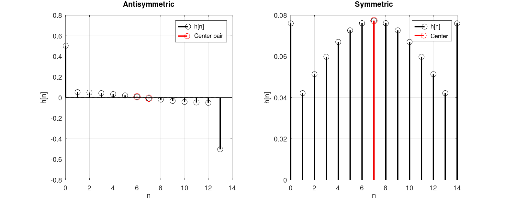
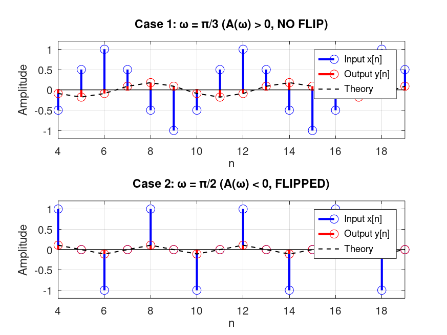

# Linear phase FIR filters
To recap from the last chapter, finite impulse response (or FIR) filters refer to filters that only have \\(x\\) terms in their equation.
As a consequence, their equation does not have any \\(y\\), i.e., feedback term, and therefore the impulse response has a finite (hence the name finite impulse response).

A desirable property that FIR filters can have is to have ***linear phase***.

It can be shown that if the impulse response is either symmetric or anti-symmetric, the corresponding filters will have linear phase.
The figure below shows examples of symmetric and anti-symmetric impulse responses.

<figure style="text-align: center;">
  
  <figcaption>Figure 1: Examples of symmetric and antisymmetric impulse responses.</figcaption>
</figure>

Each one can also have odd or even length.
Hence, we get four different types, which in the literature are labeled as FIR filters of type I, II, III and IV:

- Type I: Symmetric, odd length

- Type II: Symmetric, even length

- Type III: Anti-symmetric, odd length

- Type IV: Anti-symmetric, even length

Before understanding the effect of linear phase FIR filters on an arbitrary input we need to talk about some prerequisite concepts first.

## Complex exponentials as eigenfunctions of LCCDE filters with initial rest conditions
In the previous section, we saw that we can apply the Z-transform on an LCCDE to get:

\\[
Y(z) = H(z) X(z)
\\]

where \\(H(z)\\) is a function specific to the LCCDE.
We also saw that if we assume initial rest for the system and the ROC of \\(H(z)\\) includes the unit circle, we can substitute \\(z = e^{j\omega}\\) to obtain the frequency response:

\\[
Y(e^{j\omega}) = H(e^{j\omega}) X(e^{j\omega})
\\]

In other words, the DTFT of the output is the DTFT of the impulse response, multiplied by the DTFT of the input signal.
Equivalently, in the time domain, we have:

\\[
y[n] = h[n] * x[n]
\\]

where \\(h[n]\\) is the impulse response of the system.

Now, if the input is a complex exponential \\(x[n] = e^{j\omega_0 n}\\), we can plug that into the convolution equation and get:

\\[
y[n] = h[n] * x[n] = \sum_{m=-\infty}^{\infty} h[m] x[n-m] = \sum_{m=-\infty}^{\infty} h[m] e^{j\omega_0 (n-m)}
\\]

Factor out \\(e^{j\omega_0 n}\\) (it does not depend on \\(m\\)):

\\[
y[n] = \left( \sum_{m=-\infty}^{\infty} h[m] e^{-j\omega_0 m} \right) e^{j\omega_0 n} = H(e^{j\omega_0}) e^{j\omega_0 n}
\\]

This shows that the output is simply the same complex exponential but scaled by the DTFT of the impulse response!
In mathematical terms, the complex exponential is an eigenfunction of an LCCDE with initial rest conditions, and \\(H(e^{j\omega_0})\\) is the corresponding eigenvalue.

In Signals & Systems courses, they generalize this result to any system that is LTI (Linear and Time-Invariant).
LCCDEs with initial rest conditions have these properties, but they are not the only systems with such properties.
There are other LTI systems that arise in different areas of DSP.
For instance, when we want to model sound propagation in an acoustic medium, we often model the acoustic medium as an LTI system.
Therefore, complex exponentials are still eigenfunctions of these systems.

## The output of LCCDE due to sinusoidal functions
What if the input is a cosine function?

A cosine can be written as a sum of two complex exponentials:

\\[
x[n] = \cos(\omega_0 n) = \frac{e^{j\omega_0 n} + e^{-j\omega_0 n}}{2}
\\]

Since the system is LTI, we can use the principle of superposition: the response to a sum is the sum of the responses. Applying our eigenfunction result to each complex exponential separately:

\\[
y[n] = \frac{1}{2} \left( H(e^{j\omega_0}) e^{j\omega_0 n} + H(e^{-j\omega_0}) e^{-j\omega_0 n} \right)
\\]

If we assume that \\(h[n]\\) is real (as it almost always is for practical filters), its DTFT has conjugate symmetry:

\\[
H(e^{-j\omega_0}) = \sum_{m=-\infty}^{\infty} h[m] e^{j\omega_0 m} = \left( \sum_{m=-\infty}^{\infty} h[m] e^{-j\omega_0 m} \right)^* = H^*(e^{j\omega_0})
\\]

Now, write \\(H(e^{j\omega_0})\\) in polar form:

\\[
H(e^{j\omega_0}) = |H(e^{j\omega_0})| e^{j \angle H(e^{j\omega_0})}
\\]

Then:

\\[
H(e^{-j\omega_0}) = |H(e^{j\omega_0})| e^{-j \angle H(e^{j\omega_0})}
\\]

Substituting back:

\\[
y[n] = \frac{1}{2} \left( |H(e^{j\omega_0})| e^{j\angle H(e^{j\omega_0})} e^{j\omega_0 n} + |H(e^{j\omega_0})| e^{-j\angle H(e^{j\omega_0})} e^{-j\omega_0 n} \right)
\\]

Factor out the magnitude:

\\[
y[n] = |H(e^{j\omega_0})| \cdot \frac{e^{j(\omega_0 n + \angle H(e^{j\omega_0}))} + e^{-j(\omega_0 n + \angle H(e^{j\omega_0}))}}{2}
\\]

Using Euler's formula we get:

\\[
y[n] = |H(e^{j\omega_0})| \cos\big(\omega_0 n + \angle H(e^{j\omega_0})\big)
\\]

This tells us that the output of the system due to a cosine input is also a cosine with its amplitude and phase modified according to the above equation.

### Summary
For a cosine input \\(x[n] = \cos(\omega_0 n)\\), the output of an LCCDE with initial rest conditions, which is an LTI system, is:

\\[
y[n] = |H(e^{j\omega_0})| \cos\big(\omega_0 n + \angle H(e^{j\omega_0})\big)
\\]

The filter scales the amplitude by \\(|H(e^{j\omega_0})|\\) and phase-shifts the cosine by \\(\angle H(e^{j\omega_0})\\).

If the input is the sine function, we get an identical derivation: Assume \\(x[n] = \sin(\omega_0 n)\\), using \\(\sin(\omega_0 n) = \frac{e^{j\omega_0 n} - e^{-j\omega_0 n}}{2j}\\), gives:

\\[
y[n] = |H(e^{j\omega_0})| \sin\big(\omega_0 n + \angle H(e^{j\omega_0})\big)
\\]

The sine is scaled and phase-shifted in exactly the same way.
The only difference is that the decomposition uses a minus sign and a factor of \\(2j\\) instead of \\(2\\), and the final fraction becomes a sine instead of a cosine.

The importance of output of a system to a sinusoidal signal is that for *real-valued* signals (the types that we mostly work with), we have the
conjugate symmetry property:

\\[
X(e^{-j\omega}) = X^*(e^{j\omega})
\\]

Instead of writing the full inverse DTFT formula to express \\(x[n]\\), we can simply observe what happens at a single frequency pair.
Taking a single complex exponential component of \\(x[n]\\) at frequency \\(\omega_0\\), and since \\(x[n]\\) is real, the component at \\(-\omega_0\\) must be its complex conjugate. Together, they form:

\\[
A e^{j\omega_0 n} + A^* e^{-j\omega_0 n}
\\]

where \\(A\\) is some complex amplitude.

Now, writing \\(A = |A| e^{j\phi}\\).
Then \\(A^* = |A| e^{-j\phi}\\).
The pair becomes:

\\[
|A| e^{j\phi} e^{j\omega_0 n} + |A| e^{-j\phi} e^{-j\omega_0 n}
= |A| \left( e^{j(\omega_0 n + \phi)} + e^{-j(\omega_0 n + \phi)} \right)
= 2|A| \cos(\omega_0 n + \phi)
\\]

Therefore, for each positive frequency in the DTFT of a real signal, we can pair it with its negative counterpart to form a shifted cosine. Doing this across all frequencies, an arbitrary real signal \\(x[n]\\) can be decomposed into shifted cosine terms. 
When such a signal passes through an LTI system, each cosine component is independently scaled by \\(|H(e^{j\omega})|\\) and phase-shifted by \\(\angle H(e^{j\omega})\\).

## Filters with symmetric impulse responses
Now, imagine we have a filter whose impulse response is symmetric.
This means that mathematically, the impulse response is:

\\[
h[n] = h[M-n] \quad \text{for } 0 \leq n \leq M
\\]

and zero otherwise, for some integer \\(M\\).

The DTFT of such an impulse response can be proved to be of the following form:

\\[
H(e^{j\omega}) = A(\omega) e^{-j\omega M / 2}
\\]

where \\(A(\omega)\\) is a real, continuous, and even function of \\(\omega\\).

Such a filter is said to have **linear phase**.
The most intuitive way to see what linear phase means is to examine the output of the filter for a sinusoidal input.
Plugging the linear-phase form into formula we derived for the output of a filter for a cosine input we get:

\\[
y[n] = |H(e^{j\omega_0})| \cos\big(\omega_0 n + \angle H(e^{j\omega_0})\big)
\\]

For the symmetric case, \\(|H(e^{j\omega_0})| = |A(\omega_0)|\\) and \\(\angle H(e^{j\omega_0}) = -\omega_0 M/2\\) (assuming \\(A(\omega_0) > 0\\)).
So:

\\[
y[n] = |A(\omega_0)| \cos\big(\omega_0 n - \omega_0 M/2\big)
= |A(\omega_0)| \cos\big(\omega_0 (n - M/2)\big)
\\]

This means that for a cosine with frequency \\(\omega_0\\) that makes \\(A(\omega_0)\\) positive, the filter simply produces a cosine shifted in time by \\(M/2\\) samples.
Moreover, we get the same amount of delay for all other cosines whose frequencies make \\(A(\omega_0)\\) positive.

If \\(A(\omega_0)\\) is negative, we get an additional phase shift of \\(\pi\\), which corresponds to a sign inversion of the cosine:

\\[
y[n] = |A(\omega_0)| \cos\big(\omega_0 (n - M/2) + \pi\big) = - |A(\omega_0)| \cos\big(\omega_0 (n - M/2)\big)
\\]

In both cases, the delay is \\(D = M/2\\).
The output is simply the input cosine delayed by \\(M/2\\) samples, with its amplitude scaled by \\(|A(\omega_0)|\\).
The key point is that the delay \\(D\\) is independent of frequency.
Every cosine component gets delayed by the same amount.
This is why it's called linear phase.

### An example of a filter with symmetric impulse response
Now, let's see a simple example of a linear phase filter that has a symmetric impulse response.
Assume the impulse response of the filter is symmetric with the values:

\\[
h[n] = [0.1339, 0.1526, 0.1592, 0.1526, 0.1339]
\\]

Applying the DTFT:

\\[
    H(e^{j\omega}) = 0.1339 + 0.1526 e^{-j\omega} + 0.1592 e^{-j2\omega} + 0.1526 e^{-j3\omega} + 0.1339 e^{-j4\omega}
\\]

Factoring out \\(e^{-j2\omega}\\):

\\[
    H(e^{j\omega}) = e^{-j2\omega} \Big[ 0.1339 e^{j2\omega} + 0.1526 e^{j\omega} + 0.1592 + 0.1526 e^{-j\omega} + 0.1339 e^{-j2\omega} \Big] 
\\]

Pairing symmetric terms using \\(e^{j\theta} + e^{-j\theta} = 2 cos(\theta) \\):

\\[ 
    H(e^{j\omega}) = e^{-j2\omega} \Big[ 0.1592 + 2 \cdot 0.1339 \cos(2\omega) + 2 \cdot 0.1526 \cos(\omega) \Big]
\\]

Finally, we get:

\\[
    A(\omega) = 0.1592+ 2 [ 0.1339 \cos(2\omega)+0.1526 \cos(\omega)]
\\] 

which is the real-valued function, and:

\\[
    H(e^{j\omega}) = A(\omega) e^{-j2\omega}
\\]

Now, evaluating \\(A(\omega)\\) at two different frequencies to find two positive and negative values:

\\[
\omega_1 = \pi / 3 \rightarrow A(\omega_1) = 0.1779
\\]
And: 
\\[
\omega_2 = \pi / 2 \rightarrow A(\omega_2) = -0.1086
\\]

We have identified two frequencies at which the value of the real-valued function is positive and negative respectively.
If we have two different cosine functions as input, one with the frequency of \\(\omega_1=\pi / 3 \\) and one with \\(\omega_2 = \pi / 2\\), results in cosine functions that have same delay but one with an addition of \\(\pi\\) term in the phase (giving us a flipped cosine).

Case 1: \\(\omega_1 = \pi / 3\\)

\\[ 
    y[n] = 0.1779 \cos\big((\pi/3)(n - 2)\big) = 0.1779 \cos(\frac{n\pi}{3}​-\frac{2\pi}{3}​)
\\]

Case 2: \\(\omega_2 = \pi / 2\\)

\\[ 
    y[n] = 0.1086 \cos\big((\pi/2)(n - 2) + \pi\big) = 0.1086 \cos(\frac{\pi n}{2})
\\]

In both cases, the delay is exactly 2 samples. The only difference is the inversion when \\(A(\omega)\\) is negative.

The following graph depicts the input and output for both cases:

<figure style="text-align: center;">
  
  <figcaption>Figure 2: The output of the symmetric filter for two different cosine functions.</figcaption>
</figure>

The example we just saw is called a **Type I** FIR filter, because the impulse response is symmetric and has an odd number of elements.
As we have seen with the example, the delay that this type of filter imposes on a sinusoidal input is an integer number of samples.
For instance, it shifts the cosine input by \\(2\\) samples, as in the example.

If a filter has a symmetric impulse response but an even number of elements, the filter is said to be of **Type II**.
Type II filters have non-integer sample delay.
Moreover, for these types, the value of \\(A(\omega)\\) is always zero at \\(\omega=\pi\\).
Consequently, they are not suited for highpass filters.
In contrast, Type I filters do not have a forced zero at any frequency.
Therefore, Type I filters are more flexible and can be used for all kinds of filters (lowpass, bandpass, highpass, etc.).

## Filters with antisymmetric impulse responses
We are ready to discuss the next type of filter with linear phase, the ones that have antisymmetric impulse response.
Mathematically, the impulse response is:
\\[
h[n] = -h[M-n] \quad \text{for } 0 \leq n \leq M
\\]
and zero otherwise, for some integer \\(M\\).
Like the previous subsection, we can now apply DTFT in this function.
The result will be:

\\[
H(e^{j\omega}) = A(\omega) e^{-j\omega M / 2 + j\pi/2}
\\]

where \\(A(\omega)\\) is a real, continuous, and odd function of \\(\omega\\).

To see the effect of such a filter on a sinusoidal signal, we plug it into the formula we derived earlier for the output of a cosine input:

\\[
y[n] = |H(e^{j\omega_0})| \cos\big(\omega_0 n + \angle H(e^{j\omega_0})\big)
\\]

For the antisymmetric case, \\(|H(e^{j\omega_0})| = |A(\omega_0)|\\) and \\(\angle H(e^{j\omega_0}) = -\omega_0 M/2 + \pi/2\\) (assuming \\(A(\omega_0) > 0\\)). So:

\\[
y[n] = |A(\omega_0)| \cos\big(\omega_0 n - \omega_0 M/2 + \pi/2\big)
= |A(\omega_0)| \cos\big(\omega_0 (n - M/2) + \pi/2\big)
\\]

If \\(A(\omega_0)\\) is negative, the sign of the \\(\pi/2\\) term flips to \\(-\pi/2\\).
In both cases, the delay is still \\(D = M/2\\).
However, unlike the symmetric case where the extra phase was \\(0\\) or \\(\pi\\) (a simple sign flip), here the extra phase is \\(\pm\pi/2\\), which turns a cosine into a sine (and vice versa).

For a cosine input \\(x[n] = \cos(\omega_0 n)\\) with \\(A(\omega_0) > 0\\):

\\[
y[n] = |A(\omega_0)| \cos\big(\omega_0 (n - M/2) + \pi/2\big) = -|A(\omega_0)| \sin\big(\omega_0 (n - M/2)\big)
\\]

The output is a sine function, delayed by \\(M/2\\) samples.

Similarly, for a sine input \\(x[n] = \sin(\omega_0 n)\\) with \\(A(\omega_0) > 0\\):

\\[
y[n] = |A(\omega_0)| \sin\big(\omega_0 n - \omega_0 M/2 + \pi/2\big) = |A(\omega_0)| \cos\big(\omega_0 (n - M/2)\big)
\\]

The output is a cosine function, delayed by \\(M/2\\) samples.

As we can see, the main point remains the same.
Every frequency component gets delayed by the same amount \\(D = M/2\\).
This is still linear phase.
The constant \(\pm\pi/2\) offset simply swaps sines and cosines, but the waveform shape is preserved, just shifted in time and possibly transformed between sine and cosine.

Antisymmetric filters also come in two types, depending on whether the length is odd or even.
**Type III** filters refer to antisymmetric and odd length.
These filters always have \\(A(0) = 0\\) and \\(A(\pi) = 0\\).
Consequently, they cannot be used for lowpass or highpass filters, but are well-suited for bandpass filters and differentiators.
In contrast, **type IV** filters are antisymmetric even length.
They always have \(A(0) = 0\) (forced zero at DC) but no forced zero at \\(\omega = \pi\\).
Hence, they are suitable for highpass filters.
